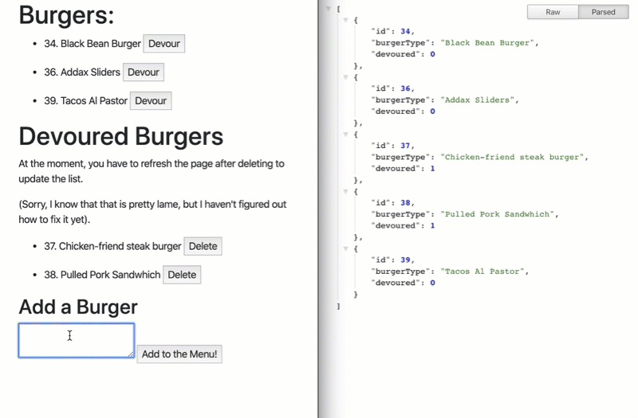
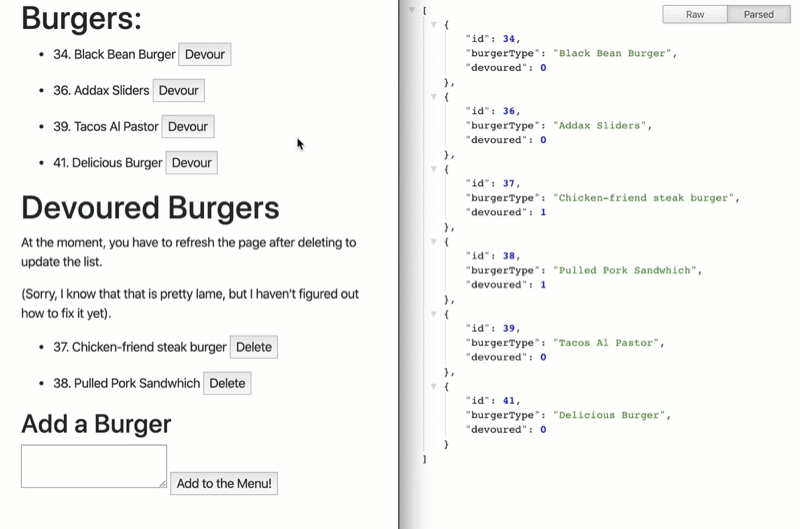
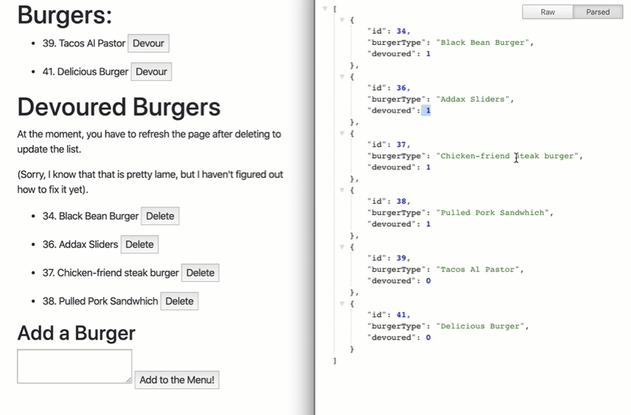

<h1> Status: WIP </h1>
 
 
<h1>"Eat da Burger"</h1>

This app uses the "mysql" node package to add, update, and delete rows in a MySQL database.

 
 
<h1>WIP Status</h1>

This project is still a WIP, and I'm having trouble getting ip up on Heroku, so here are some screen shots to show functinoality:

 
 
<h1>Functionality</h1>

This app can:

 
<h3>The user can add a burger to the database:</h3>

 
 
<h3> The user can change a burger to "devoured"</h3>

 
 
<h3>The user can delete burgers that have been "devoured"</h3>

 
 
